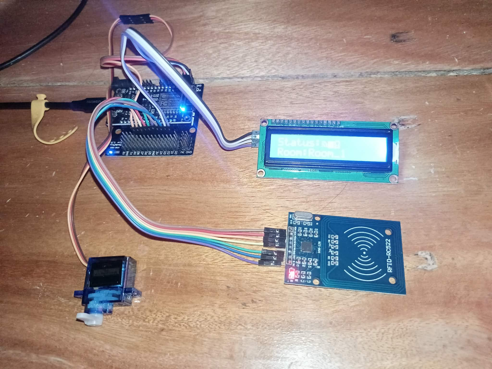
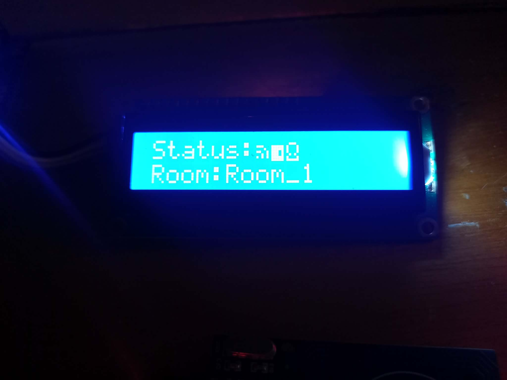

# Door Access Logging
  This is a prototype system for controlling and logging door access using RFID technology.

## Prerequisite

### Software
- PlatformIO in VSCode

### Hardware / Modules

- **RC522 RFID Reader Module**


- **NodeMCU**


- **Servo Motor**


- **I2C LCD**


## Installation

- Clone this repo
  ```
    git clone https://github.com/Teyooooo/door-access-logging.git
  ```
- Connect two component using this pinout configuration
  | RC522 RFID Reader | NodeMCU       |
  | ----------------- | ------------- |
  | SDA               | D4            |
  | SCK               | D5            |
  | MOSI              | D7            |
  | MISO              | D6            |
  | IRQ               | Not Connected |
  | GND               | GND           |
  | RST               | D3            |
  | VCC               | 3.3V          |

  | Servo Pin | NodeMCU  |
  | --------- | -------- |
  | Signal    | D8       |
  | VCC       | 3.3V / 5V|
  | GND       | GND      |
  
  | I2C LCD Pin | NodeMCU   |
  | ----------- | --------- |
  | SDA         | D2        |
  | SCL         | D1        |
  | VCC         | 3.3V / 5V |
  | GND         | GND       |

- Change some lines
  ```cpp
    const char* ssid = "your_wifi_name"; // Change it with the SSID
    const char* password = "your_wifi_password"; // Change this with the password of that SSID
    
    #define ROOM_NAME "Room_1" // In where does this install too
    
    String api = "http://192.168.100.117:5000/"; // Change it with the IP address of the server
  ```
   Server to where [Computer Laboratory Monitoring](https://github.com/Teyooooo/computer-laboratory-monitoring-admin-app) install to because [Door Access Logging API](https://github.com/Teyooooo/door-access-logging-api) is bundled in that. 


- Connect NodeMCU in the PC
- Then Flash it with the Firmware

## Usage

- Open the [Door Access Logging API](https://github.com/Teyooooo/door-access-logging-api) using the [Computer Laboratory Monitoring](https://github.com/Teyooooo/computer-laboratory-monitoring-admin-app)
- Scan a RFID Card
- Then it will Print in the LCD if it give access or not

## Image



